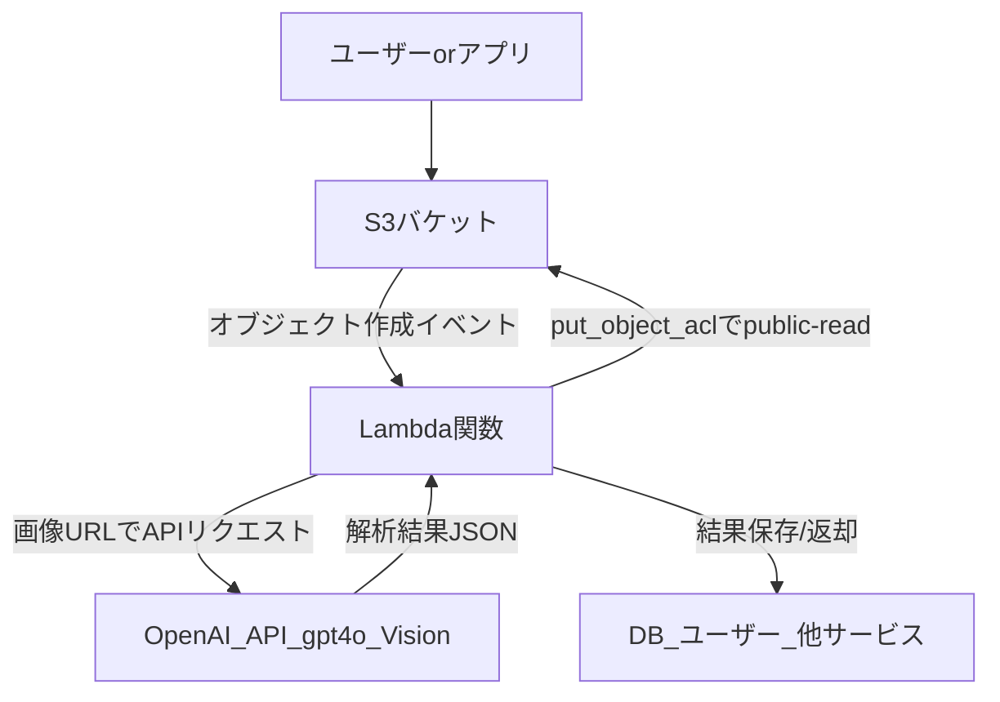

# micro-receipt-analyzer

## システム全体構成図

## プロジェクト概要

このプロジェクトは、レシート画像を S3 にアップロードするだけで、
自動的に Lambda が起動し、OpenAI の gpt-4o Vision API でレシート内容（品名・金額・合計）を高精度に解析するサーバーレス構成です。

- **CI/CD**: GitHub Actions + AWS SAM で自動デプロイ
- **サーバーレス**: S3, Lambda, IAM のみでシンプル運用
- **AI 連携**: OpenAI Vision API で日本語レシートも高精度解析
- **コスト効率**: 必要な時だけ実行、API コストも安価

## フロー説明

1. **CI/CD（GitHub Actions）**

   - コードが push/PR されると GitHub Actions が起動し、SAM で Lambda/S3 を自動デプロイ

2. **S3 への画像アップロード**

   - ユーザーやアプリが S3 バケットにレシート画像をアップロード

3. **S3 イベントで Lambda が自動実行**

   - S3 の"オブジェクト作成"イベントで Lambda がキックされる

4. **Lambda で画像をパブリック公開**

   - Lambda が`put_object_acl`で画像を public-read に設定

5. **Lambda から OpenAI Vision API へリクエスト**

   - 画像のパブリック URL を gpt-4o に送り、品名・金額・合計を JSON で抽出

6. **解析結果を保存・返却**
   - Lambda が結果を DB 保存やユーザー返却などに利用

---

- CI/CD・サーバーレス・AI 連携が一気通貫で自動化された構成です。
- コスト・精度・運用性のバランスが良い仕組みです。
